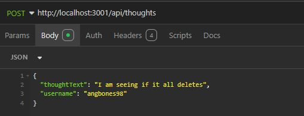
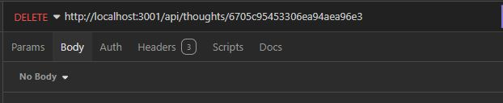
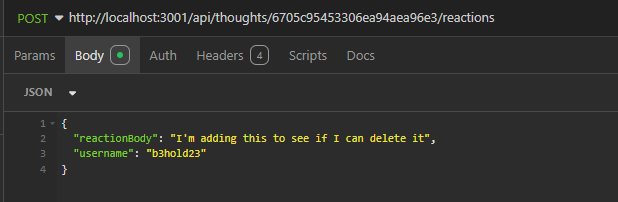
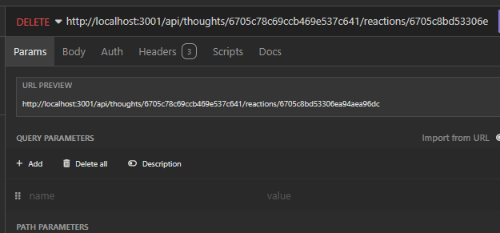

# Social Media API

## Description
Demo Link: https://drive.google.com/file/d/1XQouG26ZJlw-ZVwM7uFXF7aBkkGHGgZC/view
 
This project holds back end code for an api that pulls from a database created in mongodb for social media, you can create a user, add a thought, add a reaction to a thought. You can also add a friend or delete a friend. You can also delete your thoughts, reactions and friends. 

## Table of Contents
- [Installation](#installation)
- [Usage](#usage)
- [Credits](#credits)
- [License](#license)
- [Features](#features)
- [Contribute](#contribute)
- [Tests](#tests)

## Installation
Install the zip file from the project repository and you will need someway to test the api routes. This is all backend work.

## Usage
This used as a database for a social network where you can interact with other users and thoughts.

## License

  
This project is licensed under the MIT License - see the [LICENSE](LICENSE) file for details.

## Features
The features available at this time involve creating a user, creating a thought and reaction. When this information is put in and run it will create a user.
  

 

As a user you will be able to add a friend by putting in their id which is created automatically when you create a user. Below is a image on what to input to add a friend. It is the same input to delete a friend.
 
 
 

To create a thought you will need to put it the following information: 
 
 
 

To be able to delete a thought you will just need to put in the thought id to delete it.
 

 

Adding and deleting reactions is generally done the same way, Below are some screenshots:
 
 
## Contribute
Have fun with it. If there is anything I can do to improve please let me know.

## Tests
Here is a link showing a video demo of how to use the project: 
 
Demo Link: https://drive.google.com/file/d/1XQouG26ZJlw-ZVwM7uFXF7aBkkGHGgZC/view

## My Info
My github:
 
b3hold23 https://github.com/b3hold23
 
My email: rosa.angel.daniel@gmail.com